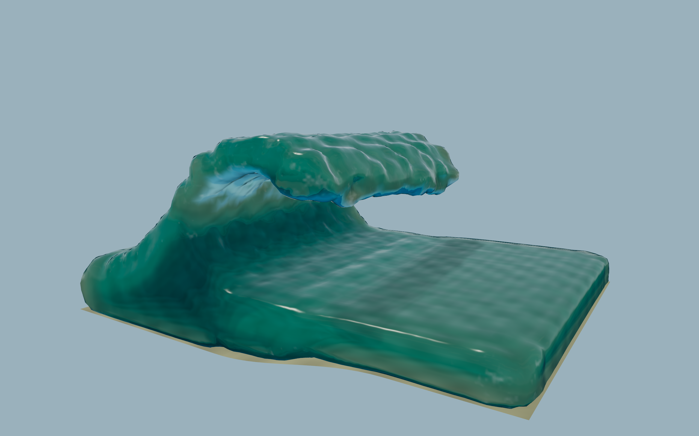
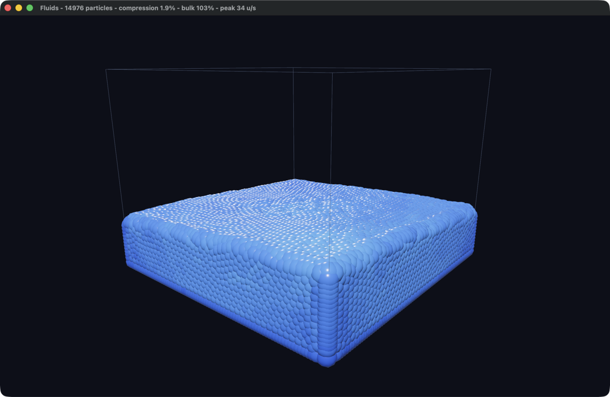

# fluids

A 3D particle water simulation in Rust and [Bevy](https://bevyengine.org), with a
continuous water surface and a plunging, thick-lipped barrel study.



The default scene releases a pitching crest over a reef shelf. The lip has real
thickness and the barrel contains air; the particle solver drives the collapse,
impact, and wash. Playback starts at quarter speed and replays automatically.

```
cargo run --release
```

For the original dam break with the new surface renderer:

```
cargo run --release -- dam-break.toml
```

This is an initialized barrel study, **not yet a simulation of offshore swell
shoaling and breaking at Pipeline**. The crest starts in a shaped configuration
with an initial velocity field. Nothing animates or holds its shape after release.
The reef is a smooth, approximate shelf, not measured Pipeline bathymetry.

## Water appearance and wave shape

The renderer reconstructs a full 3D density isosurface with marching tetrahedra,
so an overhanging lip and its underside can exist in the same horizontal location.
Smooth density-gradient normals replace the old individually lit spheres.
A matching 3D density texture lets the water shader estimate refracted path
length, color absorption, and how much the lip blocks sunlight inside the barrel.
Fresnel reflections use a procedural sky. Foam follows local velocity disorder,
persists on the particles, and dissipates; detached fast particles become spray.

The optics are approximate: the shader uses a procedural sky and seabed instead
of tracing the rendered scene. Foam is a visual aeration indicator, not a bubble
or air-pressure simulation. Isotropic reconstruction still rounds sheets thinner
than a few particles. These are the main remaining limits on realism.

Useful settings in `config.toml`:

| Setting | Effect |
|---|---|
| `wave.height` | Crest height above the pool |
| `wave.lip_thickness` | Lip thickness as a fraction of height; keep at least two particle layers |
| `wave.curl` | How far the lip has pitched at release, in radians |
| `wave.peel` | Curl variation along the crest |
| `wave.speed` | Initial crest velocity |
| `wave.reef_height` | Rise of the collision shelf |
| `scene.time_scale` | Playback speed, without changing the physics timestep |
| `scene.replay_after` | Replay interval in simulated seconds; `0` disables it |
| `render.surface_resolution` | Mesh voxel size / particle spacing; smaller costs more CPU |
| `render.foam_speed` | Foam visibility calibration; lower makes more foam visible |

Slow motion scales the simulation clock. The renderer interpolates particle
positions between fixed solver steps, so slowing playback does not increase
viscosity or artificial pressure.

Release mode matters. The solver and surface reconstruction both run on the CPU;
the title reports their costs separately. The historical solver benchmarks below
refer to the dam break, before surface reconstruction was added.

Everything tunable lives in [`config.toml`](config.toml), which is commented in
full. Every field is optional, so a file naming one value is a legal config, and
deleting the file gets you the defaults back. Pass a different one as an
argument: `cargo run --release -- big.toml`.

## Controls

| | |
|---|---|
| left mouse | push the water away from the cursor |
| shift + left mouse | pull the water towards the cursor |
| right drag | orbit the camera |
| scroll | zoom |
| space | pause / resume |
| `R` | replay the current scene, clearing foam and restoring gravity |
| `G` | flip gravity |
| `S` | toggle normal speed / slow motion |
| `P` | toggle water surface / particle diagnostic |
| `B` | toggle tank bounds |
| `F12` | save a screenshot in the working directory |

The fluid is on the left button, as it was in the 2D version; the camera took
the right one. A screen position names a ray rather than a point, so the push
gets its depth from the fluid itself — it lands on the frontmost water under the
cursor, which is what makes it feel direct rather than like pushing an invisible
plane floating in the tank.

Expect it to feel firmer than the 2D version did. A radial push in an
incompressible fluid is mostly cancelled by the density constraint — only the
free surface is really free to move — and in 3D there is more water in every
direction to resist it. `input.mouse_strength` is the knob, and `config.toml`
carries the measured response curve.

The window title shows simulation time and speed, particle count, frame/solver/
surface timings, compression, bulk density, and peak particle speed.

## How it works

The solver is [**Position Based Fluids**](https://matthias-research.github.io/pages/publications/pbf_sig_preprint.pdf) (Macklin & Müller, SIGGRAPH 2013) rather
than a force-based SPH scheme. Both model the same thing, but they enforce
incompressibility differently, and that difference decides the timestep:

- Force-based SPH turns a density error into a pressure force. The force has to
  be stiff enough to resist compression, and a stiff force needs a small step —
  the widely copied SPH demos run at `dt = 7e-4`, so ~24 substeps per frame.
- PBF treats constant density as a *constraint* and solves it by moving
  particles directly, then reads velocity back out of the positions actually
  reached. Nothing is stiff, so a full `dt = 1/60` step is stable.

One step, in `sim.rs`:

1. Apply gravity and predict positions.
2. Build neighbour lists from the predicted positions.
3. Iterate: compute each particle's density, derive the constraint multiplier
   λ, and move particles to correct the error.
4. Set `v = (p_corrected - p_old) / dt`.
5. Apply XSPH viscosity.

Deriving velocity from the corrected positions in step 4 is what makes wall
collisions and constraint corrections energy-safe for free — a particle that
gets pushed out of a wall simply *has* less velocity afterwards, with no
restitution coefficient to tune.

Three details that are load-bearing:

**Under-relaxation.** The constraint is solved with Jacobi iteration, which
updates every particle against stale neighbours. Applying the full correction
overshoots and the fluid explodes; the first version of this did exactly that,
reaching 10⁶ units/s within two seconds. `jacobi_relax` scales the correction
down, and values above 0.55 are refused.

**Calibrated rest density.** Rather than hard-coding a target density, the
solver sums the kernel over an ideal lattice at startup and uses that
(`lattice_reference`). The relaxation and artificial-pressure terms are scaled
against the same reference. This is also what made the move from 2D to 3D
survivable: the kernel normalisation constants and the neighbour count both
changed, and the calibration recomputes the target from them rather than
carrying a stale number across.

**Parallelism.** A 3D neighbourhood holds roughly twice what a 2D one did, so
the same particle count costs about twice as much. The three hot loops run under
rayon, which is why particle state lives in flat arrays rather than as ECS
components. The neighbour build is counted first and then filled, because the
lists are variable-length and a shared output vector cannot be appended to from
several threads — that two-pass version cut roughly 5 ms off the frame, since
left serial it was the majority of it.

Neighbour search is a dense uniform grid over the (fixed) bounds, rebuilt each
step by counting sort. The bounds don't move and the cell size is the kernel
radius, so a dense grid beats a spatial hash: no modulo, no collisions, and
neighbours land contiguously in memory. Neighbour lists are built once per
substep and reused across all solver iterations.

## Turning the particle count up

There are two knobs, and they do different things.

**More water, same detail (dam break).** Raise `fluid.block`. It starts in a corner and
collapses, so a bigger block means a deeper pool. Note it is cubed, not squared.
Solver cost, measured on an M4 Pro (10 performance cores):

| block | particles | ms/step | compression |
|---|---|---|---|
| `[18, 20, 18]` | 6480 | 4.6 | 0.6% |
| `[24, 26, 24]` | 14976 | 7.1 | 1.9% |
| `[30, 29, 30]` | 26100 | 10.1 | 3.2% |
| `[39, 29, 39]` | 44109 | 15.6 | 5.5% |

Those measurements cover the solver only. The new renderer also samples a 3D
density grid, extracts a surface, and uploads the mesh and volume each frame.
Compression climbing with size is just the
deeper pool — more hydrostatic load for the same iteration count.

**Finer detail, same water.** Lower `fluid.spacing`, and lower
`fluid.smoothing_radius` with it — what matters is their *ratio*, which sets the
neighbour count and the whole calibration. Keep it near 2.0.

The catch is that this one does not stand alone. Peak speed comes from gravity
and the drop height, not from resolution, so shrinking the kernel means a
particle covers more of it per step. Once that crosses 1 kernel radius,
particles cross their neighbours before the lists are rebuilt and the fluid
detonates. The fix is `solver.substeps`, and the startup check computes the
Courant number and refuses the combination rather than letting you find out at
runtime:

```
error: config.toml: the fluid would move too far per solver step to stay stable
(Courant number 1.90, limit 0.95): at spacing 4 the kernel radius is 8.0 units,
but the fluid is expected to peak near 910 units/s. Set solver.substeps = 2
(currently 1), or raise fluid.spacing, or lower world.gravity
```

One trap worth naming, because it looks like an obvious optimisation: **do not
cut `solver.iterations` to pay for the extra substeps.** Jacobi iteration
carries pressure roughly one particle per pass, so a finer grid makes the pool
deeper *in particles* and needs more passes, not fewer.

## What this does not do



**No offshore wavemaker or air phase yet.** The barrel preset is an initial
condition. Predicting a breaking wave from incoming swell will need a wavemaker,
absorbing boundaries, calibrated reef geometry, and finer fluid resolution.
Entrained air and bubble dynamics are outside this single-phase solver.

**Walls have no boundary particles.** A hard wall truncates the smoothing kernel
the same way a free surface does, so the layer of particles resting on the floor
reads as under-dense and the solver packs it about 50% too tightly. The bulk of
the fluid holds rest density to within about 2% (`the_bulk_holds_its_rest_density`
asserts this by counting particles in a ball rather than trusting the SPH
estimate, which is truncated near every surface), but the settled pool sits
around 10% shallower than its rest volume implies. The fix is boundary particles
or a wall density correction, not a change to the solver.

## Layout

| file | |
|---|---|
| `src/sim.rs` | the solver — no rendering, no ECS in the hot path |
| `src/config.rs` | the `config.toml` format, its defaults, and validation |
| `src/wave.rs` | pitching-crest initial conditions and shared reef geometry |
| `src/surface.rs` | parallel density sampling and 3D surface reconstruction |
| `src/render.rs` | surface/volume uploads, reef, spray, diagnostic view |
| `src/water.wgsl` | water absorption, reflections, light transmission, foam |
| `src/camera.rs` | orbit camera |
| `src/main.rs` | app wiring, input, window title readout |

The solver knows nothing about TOML: `Config` is the file format, and
`Config::fluid_params` converts it into the plain struct the solver takes. That
keeps sections like `[render]` out of the physics. `Config::default()` retains
the original dam-break defaults for compatibility; the shipped `config.toml`
selects the wave preset. Both configurations have physical regression tests.

The main water surface is one mesh/material. Spray and the particle diagnostic
share a small sphere mesh and material so they can be instanced. The water
shader is embedded in the executable; no external art assets are needed.

## Tests

```
cargo test --release
```

The interesting checks are physical rather than mechanical, since a fluid solver
can be wrong in ways that still compile and still produce plausible motion:

- `rest_density_matches_the_seed_lattice` — the calibration agrees with the
  lattice it was derived from. This is the check that the 3D kernel constants
  and neighbour count actually made it across from 2D.
- `stays_finite_and_bounded` — no NaNs, nothing tunnels through a wall.
- `settles_without_gaining_energy` — ten seconds in, the fluid is nearly at rest
  instead of quietly accumulating energy.
- `settles_into_a_flat_pool` — the dam break runs out to every wall and levels
  off, sampled on both sides.
- `the_bulk_holds_its_rest_density` — measured geometrically, see above.
- `radial_impulse_pushes_out_and_pulls_in` — the mouse force, which is otherwise
  only reachable by hand.
- `reconstructed_water_is_closed_with_outward_normals` — watertight mesh edges,
  outward winding, unit normals, and a reasonable reconstructed volume.
- `the_barrel_contains_air_below_a_resolved_lip` — empty cavity and overhead water.
- `a_plunging_crest_stays_finite_and_above_the_reef` — stable collapse, preserved
  particle count, reef collisions, compression, and deterministic replay.
- `slow_motion_preserves_the_physics` — identical particle states at the same
  simulated time at normal and quarter speed.
- `coherent_translation_does_not_generate_foam` — speed alone does not whiten water.

For repeatable GPU screenshots (the app renders, saves, and exits):

```
FLUIDS_CAPTURE_PATH=/tmp/barrel.png FLUIDS_CAPTURE_AT=0.25 cargo run --release
```

`FLUIDS_CAPTURE_AT` is simulation time in seconds, not wall-clock time. Captures
disable automatic replay and allow the renderer to warm up at the requested time.

The config has its own set, which mostly exist to keep it from failing quietly:
a typo'd field is rejected rather than ignored, a named config file that does
not exist is an error rather than a silent fallback to defaults, a block too big
for the tank reports the largest that fits, and `required_substeps_is_enough_to_pass`
checks that the number the error message tells you to set actually works at
every spacing — advice that is wrong is worse than no advice.

Three ignored tests are diagnostics rather than assertions:

```
cargo test --release report  -- --ignored --nocapture   # trace + ms/step
cargo test --release sweep   -- --ignored --nocapture   # parameter sweep
cargo test --release scaling -- --ignored --nocapture   # cost vs particle count
```

`scaling` produced the table above. `sweep` is how the defaults were chosen: it
reports peak speed, compression and bulk density across solver settings,
alongside the per-step cost, so the accuracy/speed trade is visible in one
table.

## Toolchain

`rust-toolchain.toml` pins 1.95, because Bevy 0.19 requires it. If you'd rather
use your default toolchain, `rustup update stable` and delete the file.
