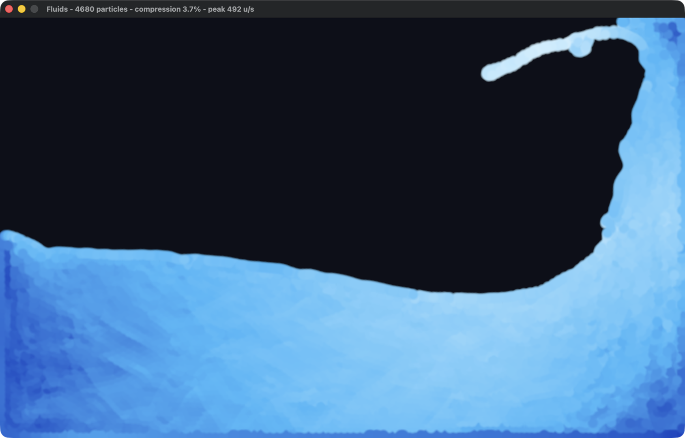
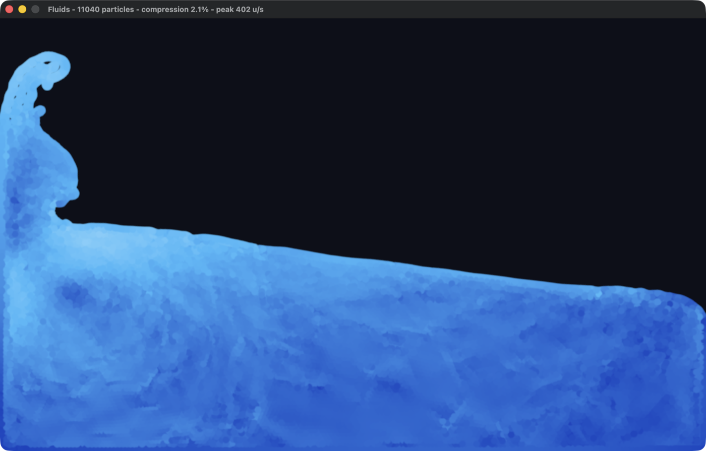

# fluids

A 2D water simulation in Rust, using [Bevy](https://bevyengine.org) for the
window and rendering.



```
cargo run --release
```

Release mode matters: the solver does roughly 5 ms of work per frame at the
default particle count, and a debug build is around 50x slower than that.

Everything tunable lives in [`config.toml`](config.toml), which is commented in
full. Every field is optional, so a file naming one value is a legal config, and
deleting the file gets you the defaults back. Pass a different one as an
argument: `cargo run --release -- big.toml`.

## Controls

| | |
|---|---|
| left mouse | push the water away from the cursor |
| right mouse | pull the water towards the cursor |
| space | pause / resume |
| `R` | reset to the starting dam break |
| `G` | flip gravity |

The window title carries a live readout: particle count, how far the fluid is
from incompressible, and the speed of the fastest particle.

## Turning the particle count up

There are two different knobs, and they do different things.

**More water, same detail.** Raise `fluid.columns` and `fluid.rows`. The block
starts in the corner and collapses, so a bigger block means a deeper pool. This
is usually what you want, and nothing else has to change. Measured on an M4 Pro
at the default spacing:

| block | particles | ms/step | 60 fps? |
|---|---|---|---|
| 61x37 | 2257 | 2.6 | yes |
| 86x52 | 4472 | 5.3 | yes |
| 104x63 | 6552 | 7.9 | yes |
| 123x75 | 9225 | 20.9 | no — needs 2 substeps |

`123x75` is the whole box at that spacing. Overshoot and the startup check tells
you the maximum that fits.

**Finer detail, same water.** Lower `fluid.spacing`, and lower
`fluid.smoothing_radius` with it — what matters is their *ratio*, which sets the
neighbour count and with it the solver's whole calibration. Keep it near 2.4.



The catch is that this one does not stand alone. Peak speed comes from gravity
and the drop height, not from resolution, so halving the kernel radius doubles
how far a particle travels per step *measured in kernel radii*. Once that
crosses 1, particles cross their neighbours before the neighbour lists are
rebuilt, the density constraint starts acting on stale information, and the
fluid detonates — measured, at spacing 8 with the default single step: 10⁶
units/s and 6000% compression.

The fix is `solver.substeps`, which splits the frame into several shorter solver
steps. Rather than let you discover this at runtime, the startup check computes
the Courant number and refuses the combination:

```
error: config.toml: the fluid would move too far per solver step to stay stable
(Courant number 1.27, limit 0.95): at spacing 5 the kernel radius is 12.0 units,
but the fluid is expected to peak near 917 units/s. Set solver.substeps = 2
(currently 1), or raise fluid.spacing, or lower world.gravity
```

Take that advice and it is stable again, at a cost of one extra pass per substep:

| spacing | particles | substeps | ms/step | 60 fps? |
|---|---|---|---|---|
| 14.0 | 2268 | 1 | 2.6 | yes |
| 10.0 (default) | 4620 | 1 | 5.6 | yes |
| 8.0 | 7275 | 2 | 17.4 | no |
| 6.5 | 10948 | 2 | 26.5 | no |
| 5.0 | 18600 | 2 | 45.8 | no |
| 4.0 | 29294 | 3 | 109.6 | no |

Cost is then clean and linear, about 1.2 µs per particle per substep.

One trap worth naming, because it looks like an obvious optimisation: **do not
cut `solver.iterations` to pay for the extra substeps.** Jacobi iteration
carries pressure roughly one particle per pass, so a finer grid makes the pool
deeper *in particles* and needs more passes, not fewer. Measured at spacing 5,
dropping from 12 iterations to 6 to afford a second substep explodes to
7.7 × 10⁶ units/s.

## How it works

The solver is **Position Based Fluids** (Macklin & Müller, SIGGRAPH 2013) rather
than a force-based SPH scheme. Both model the same thing, but they enforce
incompressibility differently, and that difference decides the timestep:

- Force-based SPH turns a density error into a pressure force. The force has to
  be stiff enough to resist compression, and a stiff force needs a small step —
  the widely copied 2D SPH demos run at `dt = 7e-4`, so ~24 substeps per frame.
- PBF treats constant density as a *constraint* and solves it by moving
  particles directly, then reads velocity back out of the positions actually
  reached. Nothing is stiff, so a full `dt = 1/60` step is stable.

One step, in `sim.rs`:

1. Apply gravity and predict positions.
2. Build neighbour lists from the predicted positions.
3. Iterate: compute each particle's density, derive the constraint multiplier
   λ, and move particles to correct the error.
4. Set `v = (p_corrected - p_old) / dt`.
5. Apply XSPH viscosity.

Deriving velocity from the corrected positions in step 4 is what makes wall
collisions and constraint corrections energy-safe for free — a particle that
gets pushed out of a wall simply *has* less velocity afterwards, with no
restitution coefficient to tune.

Two details that are load-bearing:

**Under-relaxation.** The constraint is solved with Jacobi iteration, which
updates every particle against stale neighbours. Applying the full correction
overshoots and the fluid explodes; the first version of this did exactly that,
reaching 10⁶ units/s within two seconds. `jacobi_relax` scales the correction
down. Values at or above 0.6 diverge for some iteration counts, so 0.5 is a
ceiling rather than a starting point.

**Calibrated rest density.** Rather than hard-coding a target density, the
solver sums the kernel over an ideal lattice at startup and uses that
(`lattice_reference`). The relaxation and artificial-pressure terms are scaled
against the same reference. This means `smoothing_radius` and `spacing` can be
changed without silently invalidating every other tunable.

Neighbour search is a dense uniform grid over the (fixed) bounds, rebuilt each
step by counting sort. The bounds don't move and the cell size is the kernel
radius, so a dense grid beats a spatial hash: no modulo, no collisions, and
neighbours land contiguously in memory. Neighbour lists are built once per step
and reused across all solver iterations, which is where most of the speed comes
from.

## Layout

| file | |
|---|---|
| `src/sim.rs` | the solver — no rendering, no ECS in the hot path |
| `src/config.rs` | the `config.toml` format, its defaults, and validation |
| `src/render.rs` | one sprite per particle, tinted by speed |
| `src/main.rs` | app wiring, input, window title readout |

The solver knows nothing about TOML: `Config` is the file format, and
`Config::fluid_params` converts it into the plain struct the solver takes. That
keeps sections like `[render]` out of the physics, and keeps `config.toml` the
single source of the defaults — the tests read them from there too, so they
exercise what actually ships.

Particle state lives in flat `Vec`s rather than as ECS components. Each solver
iteration touches whole neighbourhoods at random, which is much cheaper over
arrays than over archetype storage; the ECS holds only the sprites.

## Tests

```
cargo test --release
```

The interesting checks are physical rather than mechanical — a fluid solver can
be wrong in ways that still compile and still produce plausible-looking motion:

- `rest_density_matches_the_seed_lattice` — the calibration agrees with the
  lattice it was derived from.
- `stays_finite_and_bounded` — no NaNs, nothing tunnels through a wall.
- `settles_without_gaining_energy` — 15 s in, the fluid is nearly at rest
  instead of quietly accumulating energy.
- `settles_into_a_flat_pool` — the settled fluid spreads to the depth its own
  volume implies. This is the one that says *this behaves like water* rather
  than merely *this is stable*: a too-compressible solver settles high, a
  collapsing one settles low.
- `radial_impulse_pushes_out_and_pulls_in` — the mouse force, which is otherwise
  only reachable by hand.

The config has its own set, which mostly exist to keep it from failing quietly:
a typo'd field is rejected rather than ignored, a block too big for the box
reports the largest that fits, and `required_substeps_is_enough_to_pass` checks
that the number the error message tells you to set actually works at every
spacing — advice that is wrong is worse than no advice.

Two ignored tests are diagnostics rather than assertions:

```
cargo test --release report  -- --ignored --nocapture   # trace + ms/step
cargo test --release sweep   -- --ignored --nocapture   # parameter sweep
cargo test --release scaling -- --ignored --nocapture   # cost vs particle count
```

`scaling` produced both tables above. `sweep` is how the defaults were chosen. It reports peak and settled speed,
compression, and whether the fluid reached its expected depth, across a grid of
solver parameters — including the per-step cost, so the accuracy/speed trade is
visible in the same table.

## Toolchain

`rust-toolchain.toml` pins 1.95, because Bevy 0.19 requires it. If you'd rather
use your default toolchain, `rustup update stable` and delete the file.
